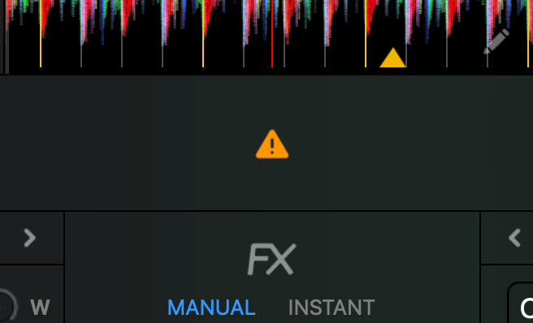
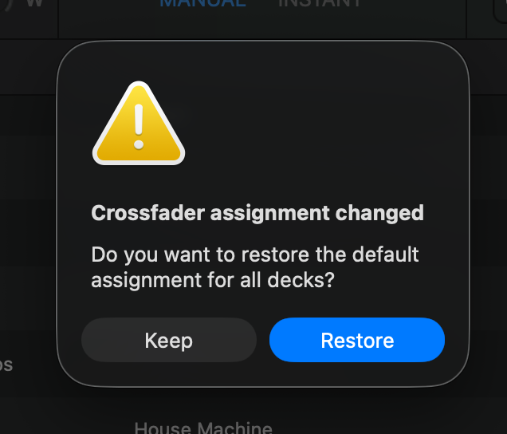
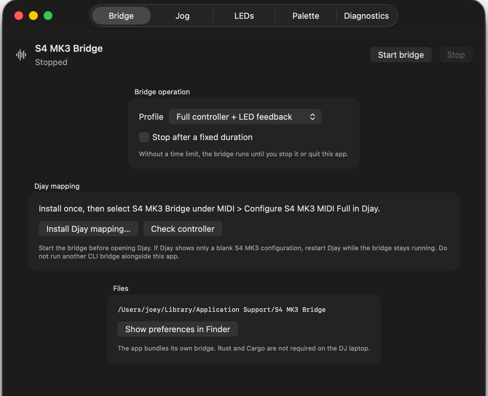
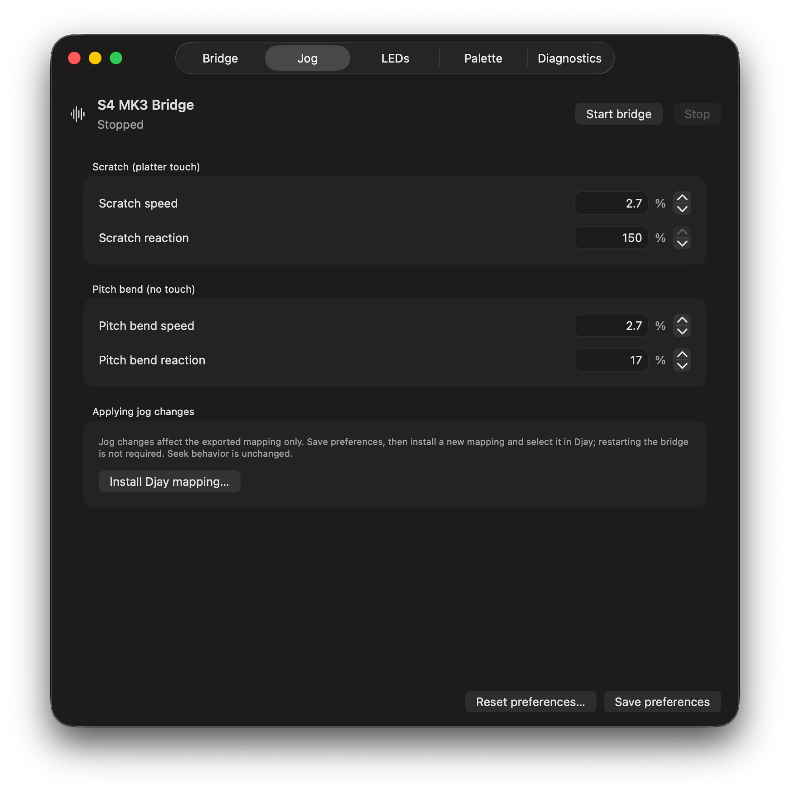

# S4 MK3 HID-MIDI Bridge

Use the Native Instruments Traktor Kontrol S4 MK3 with Djay Pro on macOS
through a menu-bar app. The bridge translates controls and drives LED feedback;
Djay sends audio directly to the S4. No development tools are needed.

**Version 0.1.0-beta.1** is a beta with a custom Djay mapping, not a recreation
of every Traktor feature. Read the control differences and known limitations
below before using it for a set.

## Requirements

- An Apple Silicon Mac running macOS 12 or later, plus a macOS version supported
  by your installed Djay Pro. (Windows Support is planned!!)
- Djay Pro with **PRO access**, which is required for custom MIDI mappings.
- A Traktor Kontrol S4 MK3, its power adapter, and a USB connection to the Mac.

## Download and install

1. Open [GitHub Releases](../../releases) and find **0.1.0-beta.1**.
2. Download **`S4 MK3 Bridge-0.1.0-beta.1-arm64.dmg`**.
3. Open the disk image, drag **S4 MK3 Bridge** to **Applications**, then eject
   the disk image.
4. Open **S4 MK3 Bridge** from Applications.

The app is ad-hoc signed, not Developer ID signed or notarized. macOS may block
the first launch because it can't verify the developer. After attempting to
open it, go to **System Settings > Privacy & Security** and choose **Open Anyway**,
then confirm **Open**. On macOS 12, use **System Preferences > Security & Privacy >
General** instead. Approve it only if you trust the download; there's no need
to disable Gatekeeper.

## First start, mapping, and audio

1. Connect and power on the S4. Run only one bridge instance.
2. Open the app's Settings from its menu-bar icon. Settings opens automatically
   on first launch; **Check controller** can help confirm the connection.
3. Select the **full-controller profile**, choose continuous operation, and
   click **Start bridge**.
4. Choose **Install Djay mapping…**, save the mapping, and accept Djay's import.
   If necessary, open the saved `.djayMidiMapping` file in Djay.
5. In Djay, enable **S4 MK3 MIDI Full** and select **S4 MK3 Bridge** as its
   mapping. Repeated imports may add a number to the name. Use the four-deck
   layout to access decks A, B, C, and D.
6. In Djay's audio settings, select the **S4's native audio device** and configure
   Main and Pre-cue outputs for the speakers and headphones. Audio goes directly
   between Djay and the S4, not through the bridge. Master, booth, headphone
   level, and headphone mix controls remain hardware-local.

**Expected THRU warning:** when a crossfader assignment switch is set to
**THRU**, Djay may show a warning triangle. Clicking it opens **"Crossfader
assignment changed"** and asks whether to restore the default assignment for
all decks. This is expected: THRU intentionally lets that channel bypass the
crossfader. This specific warning does not mean the bridge or mapping is
broken. Choose **Keep** to retain your switch assignments; **Restore** resets
them to Djay's defaults.

If Djay shows only a blank S4 configuration, restart Djay with the bridge
already running. After reconnecting Djay or reselecting its mapping, use
**Stop bridge**, then **Start bridge** to refresh crossfader assignment and curve
initialization.

When updating, install and select the mapping from the new app. Save it under
a new filename and keep any custom mappings under their existing names.
Restarting the bridge alone doesn't update Djay's mapping.

Closing Settings leaves the app running in the menu bar. Use **Stop bridge**
to stop control translation, or **Quit S4 MK3 Bridge** to quit.

_Bridge controls and mapping installation._

## Controls and differences from Traktor

The mapping covers four-deck transport, touch scratching and pitch bending,
mixing, EQ, headphone cue, loops, browsing, hotcues, samples, Neural Mix, and
effects. A/C and B/D select the deck controlled by each side. Software feedback
drives button and pad LEDs, channel meters, and jog-ring decoration.

These are intentional custom mappings. Djay's loop, Neural Mix, and effect
models differ from Traktor's, so the same labels don't always mean the same
thing.

| Control                            | Behavior in this bridge                                                                                                                                                                                                               |
| ---------------------------------- | ------------------------------------------------------------------------------------------------------------------------------------------------------------------------------------------------------------------------------------- |
| **LOOP turn / press**              | Select loop size / toggle the loop. Loop size is independent of MOVE's jump length, unlike Traktor's shared length.                                                                                                                   |
| **MOVE turn**                      | Jump by the selected jump length, or move the active loop by that length. Each deck keeps its own loop and jump sizes.                                                                                                                |
| **MOVE press**                     | Toggle jump-size selection. Turn MOVE to change the size immediately; press again to exit. The selected deck's selector pulses while selecting. The mode survives deck switches, has no timeout, and clears when the bridge restarts. |
| **Shift+MOVE turn**                | Jump one beat per step in either direction, even during size selection, without changing the chosen jump length.                                                                                                                      |
| **Shift+LOOP turn / press**        | Move the loop region / reloop the stored loop range. Manual loop in/out isn't mapped. These replace Traktor's shifted key/quantize functions.                                                                                         |
| **REV**                            | Reverse only while held. Release ends reverse. It doesn't automatically enable Slip as Traktor enables Flux; use FLUX to control Slip independently.                                                                                  |
| **Sync / Shift+Sync**              | Normal Sync is deck-specific. Shift+Sync on either side cycles Djay's tempo-fader range **globally for all decks**, rather than locking one deck's tempo fader as in Traktor. Djay determines the ranges and their order.             |
| **Channel FX1 / FX2**              | Choose the deck controlled by the left / right FX strip. These are per-deck control targets, not Traktor's shared FX buses or audio-routing assignments.                                                                              |
| **FX strips**                      | Control three manual effects on the target deck; Shift with an effect button selects the next effect. See the bank-enable limitation below.                                                                                           |
| **Channel FX SELECT and mixer FX** | Select the deck for mixer instant FX. The mixer FX buttons and Filter Reset affect that selected deck, not all decks.                                                                                                                 |
| **STEMS / MUTE**                   | Both select the same Neural Mix layer: four mute pads and four solo pads; Shift with pads 1-4 provides exclusive solo. MUTE isn't a held Traktor-style modifier.                                                                      |
| **REC**                            | Assigned to Djay's Record Sample action, but its behavior remains unresolved. Don't rely on it as Traktor's Pattern Recorder.                                                                                                         |
| **Preview**                        | Toggle library preview on/off. It isn't Traktor's hold-to-preview interaction, and encoder preview seeking isn't implemented.                                                                                                         |

HOTCUE pads trigger eight hotcues; Shift clears them. SAMPLES pads play
samples; Shift stops them. A/C share sampler bank 1, and B/D share bank 2.
Neural Mix availability depends on the track and Djay support.

**Screens and motors aren't supported.** JOG/TT select software wheel behavior,
not powered platter rotation. There are no on-device pad legends, haptic cues,
or wheel-tension controls. Jog-ring animation is decorative, not track-position
or physical-platter-position tracking.

## App settings

### LEDs and palette

Settings includes deck, stem, and hotcue colors; lamp brightness; loop and
tempo-center indicators; decorative jog-ring animation; and channel-meter
appearance. LED settings can be imported or exported.
Choose **Save and restart** to apply LED changes. A mapping export isn't needed.
Saved LED preferences are preserved across app updates.

All eight selectable Djay hotcue colors have been physically confirmed:
red, orange, blue, yellow, green, azalea, cyan, and purple. White isn't offered
in Djay's hotcue picker; its separate fallback hasn't been verified.

### Jog feel

The **Jog** tab sets Speed and Reaction for all four decks. The calibrated
defaults are:

| Action                   | Speed | Reaction |
| ------------------------ | ----: | -------: |
| Scratch while touching   |  2.7% |     150% |
| Pitch bend without touch |  2.7% |      17% |

Save your preferences, then use **Install Djay mapping…** to export a new
mapping and select it in Djay. Export uses the current editor values and can
run while the bridge is running. **Saving or restarting alone doesn't apply
jog changes.** Keep existing custom mappings under their original names.

These settings adjust Djay's response, not mechanical resistance, and don't
resolve released-backspin behavior.

_Jog settings with example custom values; the beta defaults are listed above._

## Known issues and limitations

The [current issue checklist](docs/issues.md) is the source of truth. Older
test records describe earlier builds and may still list completed work as
pending. LOOP/MOVE, Reloop, momentary REV, Browse direction, crossfader startup,
Shift+Sync, and the eight selectable hotcue colors have been confirmed in
controller testing.

Open bugs and unresolved behavior:

- **Jog feel and backspin:** backspin still ends on touch release. Slow/fast
  response, final stop behavior, and reported higher mechanical tension need
  further work; calibrated settings aren't full Traktor jog parity.
- **FX bank enable:** the leftmost FX button duplicates slot 1. Whole-bank
  bypass that preserves individual slot states remains unresolved.
- **REC:** recording source, destination/sample slot, and press/hold behavior
  aren't established.
- **Preview scrubbing:** a suitable preview-seek action and interaction haven't
  been established.
- **MUTE/STEMS:** the current alias works as described above, but a possible
  held modifier and final pad behavior are undecided.
- **FX SELECT / Filter Reset:** reset currently targets only the selected deck.
  Intended behavior, reset-to-neutral, and knob pickup still need validation.
- **EXT, microphone, and line inputs:** S4 input channels, hardware source
  switching, and supported Djay routing remain unresolved.
- **Mapping reconnect/reselection:** automatic detection isn't implemented.
  Stop and start the bridge after either event.

Independent loop/jump sizes, global Shift+Sync, per-deck FX targeting, and REV
without automatic Slip are design choices, not outstanding fixes.

## Roadmap

- Refine jog feel and released backspin, and resolve the open FX, recording,
  preview, pad, and external-input questions.
- Investigate haptic motor and wheel-tension control separately. Screens,
  pad legends, and an on-controller settings gesture remain deferred.
- Explore a standalone hardware bridge longer term, along with other DJ
  applications and simpler guest setup. These aren't features of this beta.

## Beta feedback

Report problems through the repository's Issues tab. Include the app version,
macOS and Djay versions, selected mapping name, deck and modifier/pad mode,
steps to reproduce, and expected versus actual behavior. For jog or LED
problems, a short video helps. Include relevant app **Diagnostics** output,
checking it for private information before sharing.

## Thanks

Thanks to RufusIbiza, maintainer of [Encdr](https://github.com/RufusIbiza/Encdr),
for the S4 MK3 protocol documentation and controller support this bridge builds on.

## Developer and reference documentation

- [macOS app, packaging, and developer checks](macos/README.md)
- [Full mapping layout and test records](docs/full-midi-test.md)
- [Settings and control tuning](docs/configurable-controls.md)
- [Current issue checklist](docs/issues.md)
- [Traktor comparison and historical evidence](docs/traktor-djay-comparison.md)
- [Djay action reference](docs/djay-action-reference.md)
- [Bridge function reference](docs/bridge-function-reference.md)
- [LED feedback](docs/led-feedback.md)
- [Design history](docs/design.md)
